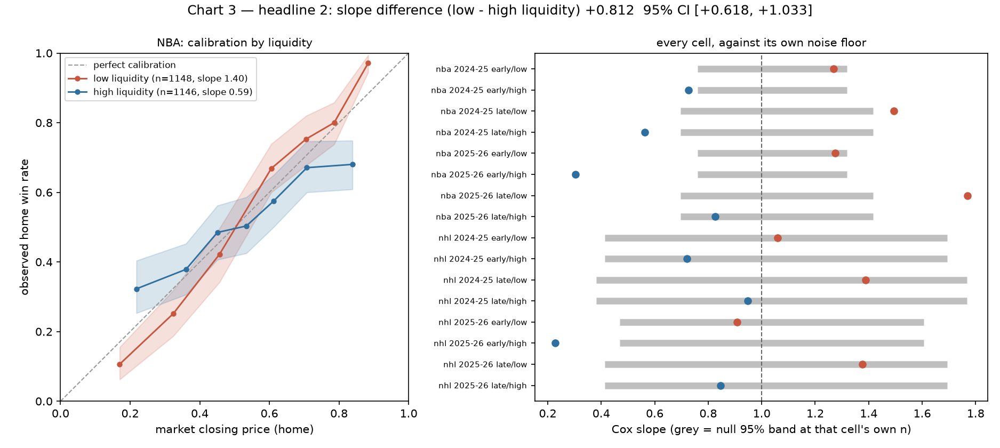

# Where a real-money market is miscalibrated

**Thin Polymarket sports markets are underconfident. Liquid ones are overconfident. The gap
is large, and it survives every check we could throw at it.**

Artifact v1, 25 September 2026. Headline 2 of two; the model half (headline 1) is not in
this document and is not claimed here. Pre-registered in
[PREREGISTRATION.md](https://github.com/arjasa1103/Chira/blob/main/PREREGISTRATION.md)
before any statistic was computed, with every amendment dated and its reason recorded.

---

## The result

In NBA moneyline markets, the logistic (Cox) calibration slope is:

| Liquidity stratum | Cox slope | n |
|---|---|---|
| **low** | **+1.398** | 1,148 |
| **high** | **+0.586** | 1,146 |
| **difference (low − high)** | **+0.812** | 95% CI **[+0.602, +1.037]** |

A slope above 1 means the market is **underconfident**: prices sit closer to 0.50 than the
outcomes justify, so a 0.70 favourite wins more often than 70% of the time. Below 1 means
**overconfident**: prices are too extreme. Thin markets do the first, liquid markets do the
second, and the difference is about 0.8 in slope units.

The interval quoted is the **date-clustered** one, which is the wider of the two we computed.
The pre-registered game-level bootstrap gives [+0.618, +1.033]. No bootstrap replicate of
2,000 reproduced the opposite sign under either scheme, so the achieved significance level is
**< 0.0005** — a floor set by the replicate count, not a measured zero, and a bootstrap ASL
rather than a null-hypothesis p-value.



Left: the two calibration curves, with 95% bootstrap bands. Right: every stratum cell's
slope against the grey band a **perfectly calibrated** market could produce at that cell's
own sample size. That grey band is the reason this page makes a pooled claim and not sixteen
per-cell ones.

---

## What was measured

Every NBA and NHL regular-season game in 2024-25 and 2025-26, matched to its Polymarket
moneyline market:

| | Games |
|---|---|
| Scheduled | 5,084 |
| Priced (market found, closing price extracted) | 4,661 |
| Classified misses (421 no market, 2 no pre-tipoff price) | 423 |
| Raw minute-level price observations stored | 145,626,599 |

Coverage is 99.9% and 99.7% for NBA, 99.8% for NHL 2025-26, and 68.3% for NHL 2024-25 —
that last one because Polymarket listed no NHL markets before December 2024, which is a
launch date, not a collection failure.

The closing price is the home-side token's last quote at or before the **league's own**
tipoff time. It is not Polymarket's `gameStartTime`: that field disagreed with the league by
more than 15 minutes on 69 priced games, by up to 360 minutes, which admits in-game prices
into a "closing" price. One market stored 0.9995 on a game that finished 115-113. That
correction is [Amendment 1](https://github.com/arjasa1103/Chira/blob/main/PREREGISTRATION.md)
and the original-definition value is kept for every game so any result can be re-run both
ways.

All analysis runs against an immutable Parquet snapshot, `census-20260913-224d6ad985e0`,
content-hashed per file, never against the live API.

### The market overall, before stratifying

| Sport | Season | n | Brier | ECE | Cox slope | Resolution |
|---|---|---|---|---|---|---|
| NBA | 2024-25 | 1,229 | 0.1992 | 0.0271 | 0.990 | 0.048 |
| NBA | 2025-26 | 1,226 | 0.1941 | 0.0241 | 1.045 | 0.052 |
| NHL | 2024-25 | 896 | 0.2304 | 0.0349 | 1.024 | 0.015 |
| NHL | 2025-26 | 1,310 | 0.2446 | 0.0321 | 0.790 | 0.005 |

Unstratified, **the market looks well calibrated** — every ECE sits inside its own simulated
noise floor, and reliability is 0.0006 to 0.0015 against an uncertainty of about 0.247. The
liquidity result is invisible at this level because the two strata pull in opposite
directions and cancel. That is the point of stratifying.

The resolution column is the other headline: it measures how far prices move away from the
base rate. NBA closing prices beat "always pick the home team" by 0.048-0.052 Brier. **NHL
2025-26 beats it by 0.005.** A market that quotes near the base rate is perfectly calibrated
and nearly uninformative, which is why NHL is reported here as a contrast case and the
primary test runs on NBA
([Amendment 3b](https://github.com/arjasa1103/Chira/blob/main/PREREGISTRATION.md)).

---

## How the strata are defined

A 2×2: liquidity × season phase, both as equal-count median splits **inside each
sport-season**, ties to the early and low side.

| Sport-season | week median | volume median, early | volume median, late | no volume |
|---|---|---|---|---|
| NBA 2024-25 | 13 | $216,662 | $383,193 | 0 |
| NBA 2025-26 | 13 | $1,765,497 | $2,478,575 | 161 |
| NHL 2024-25 | 18 | $38,376 | $80,082 | 0 |
| NHL 2025-26 | 13 | $469,215 | $791,663 | 157 |

**Liquidity is cut inside each phase, not inside the season, and that detail decides the
result.** Volume climbs steeply through a season (Spearman +0.36 to +0.53 against week of
season), so the pre-registered within-season cut put 66-72% of low-liquidity games in the
early phase. The two axes of the 2×2 were nearly the same cut, and the primary test is a
difference *between* strata, so the confound would have landed directly on the headline.
Cutting within phase restores balance to 0.503-0.534 and evens the cells to 221-312 games.
This was measured and fixed before the test ran
([Amendment 3a](https://github.com/arjasa1103/Chira/blob/main/PREREGISTRATION.md)).

---

## Robustness

Every split points the same way. All exploratory under the pre-registered family-wise policy,
which reserves confirmatory status for the single primary test above.

| Check | difference | 95% CI | excludes zero |
|---|---|---|---|
| At the close (primary) | +0.812 | [+0.618, +1.033] | yes |
| T−1h | +0.826 | [+0.620, +1.014] | yes |
| T−6h | +0.834 | [+0.633, +1.043] | yes |
| T−24h | +0.853 | [+0.639, +1.084] | yes |
| 2024-25 only | +0.741 | [+0.464, +1.036] | yes |
| 2025-26 only | +0.911 | [+0.617, +1.241] | yes |
| stale closes only (n=485/435) | +0.866 | [+0.582, +1.195] | yes |
| fresh closes only (n=663/711) | +0.770 | [+0.511, +1.055] | yes |
| date-clustered bootstrap (311 dates) | +0.812 | [+0.602, +1.037] | yes |

The four time-to-close looks are four looks at **one** sample, so they are four intervals and
never one combined interval, which would be too narrow by construction.

### The artifact that could have explained it away

Volume is outcome-correlated: close games attract volume. That predicts high-liquidity games
cluster near 0.50, and they do — sd of logit price 0.949 against 1.207, with 50.7% inside
[0.35, 0.65] against 31.5%. A slope fitted over a narrower price range **attenuates toward
zero**, so the entire contrast might have been a range effect rather than a calibration
difference.

| Check | difference | 95% CI | excludes zero |
|---|---|---|---|
| restricted to p ∈ [0.20, 0.80] | +0.659 | [+0.359, +0.953] | yes |
| restricted to p ∈ [0.35, 0.65] | +0.512 | [−0.190, +1.329] | **no** |
| caliper-matched on \|logit p\|, 917 pairs | +0.804 | [+0.559, +1.057] | yes |

Matching equalises the price spread almost exactly (sd 0.595 against 0.593) and returns
+0.804, indistinguishable from the unmatched +0.812. **The contrast is not a price-range
artifact.** In the narrowest band the sign holds but the interval opens up: n falls to
362/581 and the price range is nearly flat, which is what an underpowered test looks like.

### Why clustering barely changed anything

Le (2026) reports that under event-clustered standard errors roughly half of raw
calibration-slope variation is estimation noise, so we computed a date-clustered bootstrap
as well. It widened the interval by 5% (width 0.435 against 0.415) and left the conclusion
intact. The reason is structural rather than lucky: the estimand is a **within-date
difference** between two strata that appear on the same nights, so a shock shared by a whole
slate largely cancels. Clustering would matter if the *gap itself* varied by date, and our
test suite checks exactly that case.

---

## Read the per-cell numbers with their noise floor

<details>
<summary>All 16 cells (click to expand)</summary>

| Cell | n | slope | null slope 95% band | ECE | null ECE p99 |
|---|---|---|---|---|---|
| NBA 2024-25 early/low | 316 | +1.269 | [0.760, 1.319] | 0.0510 | 0.0991 |
| NBA 2024-25 early/high | 315 | +0.726 | [0.760, 1.319] | 0.0666 | 0.0991 |
| NBA 2024-25 late/low | 299 | **+1.494** | [0.696, 1.417] | 0.0829 | 0.1299 |
| NBA 2024-25 late/high | 299 | **+0.563** | [0.696, 1.417] | 0.0817 | 0.1299 |
| NBA 2025-26 early/low | 321 | +1.276 | [0.760, 1.319] | 0.0503 | 0.0991 |
| NBA 2025-26 early/high | 320 | **+0.303** | [0.760, 1.319] | 0.1071 | 0.0991 |
| NBA 2025-26 late/low | 212 | **+1.769** | [0.696, 1.417] | 0.0962 | 0.1299 |
| NBA 2025-26 late/high | 212 | +0.826 | [0.696, 1.417] | 0.0673 | 0.1299 |
| NHL 2024-25 early/low | 227 | +1.059 | [0.414, 1.694] | 0.0639 | 0.1288 |
| NHL 2024-25 early/high | 226 | +0.721 | [0.414, 1.694] | 0.0762 | 0.1288 |
| NHL 2024-25 late/low | 222 | +1.389 | [0.382, 1.767] | 0.0811 | 0.1414 |
| NHL 2024-25 late/high | 221 | +0.947 | [0.382, 1.767] | 0.0594 | 0.1414 |
| NHL 2025-26 early/low | 333 | +0.907 | [0.470, 1.605] | 0.0790 | 0.1118 |
| NHL 2025-26 early/high | 332 | +0.229 | [0.470, 1.605] | 0.0881 | 0.1118 |
| NHL 2025-26 late/low | 244 | +1.377 | [0.414, 1.694] | 0.0665 | 0.1288 |
| NHL 2025-26 late/high | 244 | +0.846 | [0.414, 1.694] | 0.0873 | 0.1288 |

Bold slopes fall outside their own null band. Every number here is in
[charts/headline2.json](charts/headline2.json).

</details>

**Low exceeds high in all 8 sport-season × phase pairs, NHL included.** Eight subsamples, one
direction, is the strongest thing in the table.

**And yet no single cell should be read as a finding.** At NHL n=225, a market that is
*perfectly calibrated by construction* produces an ECE up to 0.1288 at the 99th percentile
and a slope anywhere in [0.414, 1.694]. Those bands come from simulating the null on the
census's own price distribution, 1,500 replicates per sample size. Per-cell calibration at
this n is close to unfalsifiable, so the claim lives in the pooled contrast and its interval.
Reporting the bands is not modesty; it is what makes the pooled claim legible.

---

## What this is not

- **Not blind.** Candidate strata designs were evaluated in week 5 with Cox slope point
  estimates visible on real outcomes, so the direction of this result was known to the author
  before the pre-registered analysis ran. The design was chosen on orthogonality and cell
  balance — both computable without outcomes — and the contrast was near-identical under all
  three candidates, so the choice cannot have been selecting the largest difference. That is
  still a permanent loss of blindness, recorded in
  [Amendment 3c](https://github.com/arjasa1103/Chira/blob/main/PREREGISTRATION.md) with the
  point estimates that were visible. What was genuinely untested until the run: every
  interval, the phase axis, the per-cell structure, the robustness splits, and the
  range-artifact checks.
- **Not a betting edge, and not advice.** This measures calibration. There is no staking
  model, no transaction costs, no bid-ask spread, and no liquidity model for getting size
  down in exactly the thin markets where the effect is largest. A calibration gap is not a
  return.
- **Not causal.** Volume is terminal cumulative volume: it is measured after the fact, it is
  mutable upstream, and it correlates with how close a game turned out. Caliper matching
  removes the price-range channel, not every path from outcome to volume.
- **Not complete in coverage.** 318 games have no per-market volume in Polymarket's API at
  all — a contiguous March 2026 block, confirmed against three endpoints — so they are
  excluded from the liquidity axis and never proxied. They are late-season, so NBA 2025-26's
  late cells hold 212 games against 321 early. An event-level proxy was adopted and then
  **withdrawn on measurement**: it exists for only ~36% of them and reads $350-$11,169
  against season medians of $604k and $2.03M
  ([Amendment 4](https://github.com/arjasa1103/Chira/blob/main/PREREGISTRATION.md)).
- **Not a finished test plan.** Six of the seven designated P1 tests are in place. The
  seventh, a leakage canary, guards point-in-time feature machinery that does not exist yet;
  it is scheduled with that code rather than counted here.
- **Not a dataset release.** Polymarket's terms define "Data" to include derived and
  aggregated forms and restrict redistribution, so this project publishes code and results,
  not data. Regenerate the census yourself with the commands below.
- **One platform, two sports, two seasons.** Nothing here says anything about other venues,
  other sports, or other years.
- **Brier is primary here; one cited paper would rank differently.** Wheatcroft (2019) finds
  the log score outperforms both the RPS and Brier. Our pre-registration chose Brier as
  primary for boundedness, and reports clipped log loss alongside. See
  [prior art](prior-art.md).

---

## Prior art

Four sources, two read in full, one blocked to automated access, one not found, and one that
**contradicts a claim our own plan made about it.** The closest work is Le (2026), which
decomposes the same estimand across 353M trades on Kalshi and Polymarket and finds
trade-size compression that is *not robust on Polymarket* — the platform where this result
sits. Full positioning: **[prior-art.md](prior-art.md)**.

---

## Reproduce it

No dataset to download. The census regenerates from public endpoints.

```bash
git clone https://github.com/arjasa1103/Chira && cd Chira
uv sync --extra store --group dev
uv run pytest -q                       # 711 tests, offline, Linux/macOS/Windows
uv run python scripts/reproduce.py      # prints the plan, runs nothing
uv run python scripts/reproduce.py --run
```

Full instructions, per-command costs and the resume path are in the
[README](https://github.com/arjasa1103/Chira/blob/main/README.md). The census is about
16,400 requests at 5 requests/second against a public API; it needs a residential IP because
`stats.nba.com` blocks most cloud ranges, and roughly 6 GB of disk.

Once the census and snapshot exist, this page's numbers come from one command:

```bash
uv run python scripts/run_headline2.py --reps 2000
```

The seed is fixed, so the point estimates and intervals reproduce exactly.

---

## Licence and citation

Code is MIT. This writeup, its figures and the statistics behind them are
[CC BY 4.0](https://creativecommons.org/licenses/by/4.0/). Neither grants rights over
Polymarket's market data or the leagues' data, which this project does not redistribute.

> Chira: where a real-money market is miscalibrated. Artifact v1, 25 September 2026.
> Snapshot `census-20260913-224d6ad985e0`. https://github.com/arjasa1103/Chira
